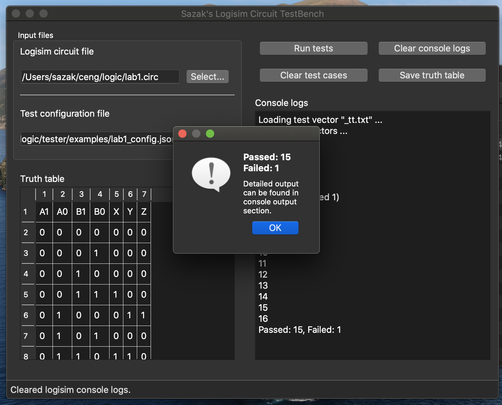
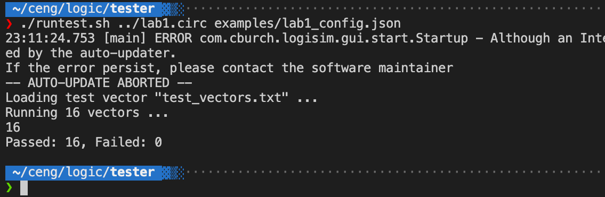

# CENG232 Logisim TestBench

This project aims for creating an open-source Logisim circuit black-box testing platform for CENG232 Logic Design homeworks.

**Technology stack**: I used Python3 and Bash for scripts. Also JSON file type is used for circuit functionality definitions.

## Dependencies

There is no need to install any software to use this tool if you are working in a Linux-based platform. The Logisim Evolution version is already included in the project root.

The only dependencies are:
* Python3
* Bash

An example GUI output for a successfull testing is as below,



## Installation

The project is already pre-configured to be run in just one command. The usage instructions are below.

## GUI

The last version of TestBench comes with a sweet UI. To use the testbench with graphical interface, just run the command below,

```bash
cd src/
python3 ui.py
```

## Usage

### Test Configuration

To use the TestBench, you need to configure the circuit functionality. This is made using JSON file type.

The configuration file consists of three parst. **Input**, **output** and **variable**s. Inputs are bound to variables, then variables are used to configure outputs.

```
Input pins => Variables => Output pins
```

#### Inputs

The `inputs` part is an array of strings. The elements **must** be of the labels of inputs pins in the *.circ* file.

Example,

```json
"inputs": [
    "A",
    "B"
]
```

#### Variables

The variables are Pythonic structures that holds the value of **one or more** pins. These variables are used to define the functionality of output pins.

* Only input pins can be used in variable definition.
* Variables can hold value of one or more pins.
* Definitions are Python expressions.
* Pins are expressed using a dollar-sign in definitions, such as Bash scrips.
* One-pin value variable is defined as `int($PIN)` for a pin named 'PIN'
* Two-pin value variable is defined using pipe operator (`|`) such as `$P1 | $P0` for pins named 'P1' and 'P0'.
* Many-pin value variable is defined as `$PA | $PB | $PC | ...`, using the pipe operator more than once.

Example,

```json
"variables": {
    "a": "int($A)",
    "b": "int($B)",
    "c": "$C | $D"
}
```

#### Outputs

The outputs are also Pythonic structures that holds the value of output pins. The output pins are defined **using only** variables.

* Only variables can be used in output pin definition.
* Definitions are Python expressions.
* Variables are expressed using a dollar-sign in definitions, such as Bash scrips.

Example,

```json
"outputs": {
    "AND": "$a * $b",
    "OR": "$a + $b",
    "NOR": "($a + $b) != 0"
}
```

There is a well done example configuration below,

```json
{
    "inputs": [
        "A",
        "B"
    ],
    "variables": {
        "a": "int($A)",
        "b": "int($B)"
    },
    "outputs": {
        "AND": "$a * $b",
        "OR": "$a + $b",
        "NOR": "($a + $b) != 0",
        "XOR": "($a + $b) % 2",
        "XNOR": "($a + $b) % 2 == 0"
    }
}
```

The equivalent functions for the configuration above is,

```C
AND = A && B;
OR = A || B;
NOR = !(A || B);
XOR = A ^ B;
XNOR = !(A ^ B);
```

### The Test Runner

When the configuration file is ready, the only thing to be done to test your circuit is to use the `runtest.sh` script. It will automatically generate truth tables and test your circuit through the test cases.

```bash
chmod +x runtest.sh
./runtest.sh <circ-file> <config-file>
```

For example, if you have `lab1.circ` and `lab1-config.json` files, then run the commands as below,

```bash
cd src/
chmod +x runtest.sh
./runtest.sh lab1.circ lab1-config.json
```

An example terminal output for a successfull testing is as below,



## Known issues

You cannot construct complex circuit definitions with the current parsing technique. Honestly, I could have designed a description language and its parser, compiler etc. for this project, but I have many projects to contribute :)

## Getting help

You can get in contact with me using my e-mail addresses,

* ozan.sazak@protonmail.ch
* sazak@ieee.metu.edu.tr
* ozan.sazak@metu.edu.tr

## Getting involved

If you want to contribute to my project, there are a few features I would appreciate if someone else helps me to implement,

* Custom description language and parser
* ~~Graphical interface for the whole tool~~
* Better code documentation

----

## Open source licensing info
1. [LICENSE](LICENSE)
2. [CFPB Source Code Policy](https://github.com/cfpb/source-code-policy/)
